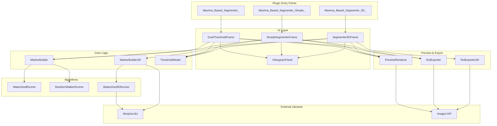

# Design Document: Maxima-Based Segmenter Suite

## Overview

This design describes the transformation of the existing Area_Segmentater plugin into a suite of three related ImageJ/Fiji plugins for maxima-based segmentation:

1. **Maxima_Based_Segmenter** (Renamed Plugin): The full-featured 2D plugin with all advanced options, renamed from Area_Segmentater with improved defaults and UI behavior
2. **Maxima_Based_Segmenter_Simple** (Simple Plugin): A streamlined 2D plugin with minimal UI for quick maxima-based watershed segmentation
3. **Maxima_Based_Segmenter_3D** (3D Plugin): A 3D extension using MorphoLibJ for volumetric segmentation

### Design Goals

- Maximize code reuse between plugins to minimize maintenance burden
- Provide clear separation of concerns through modular architecture
- Maintain backward compatibility for the renamed plugin's core functionality
- Leverage existing ImageJ/Fiji ecosystem libraries (MorphoLibJ for 3D)
- Follow established patterns from the existing codebase

### Key Design Decisions

1. **Single Repository, Multiple Plugins**: All three plugins will reside in the same Maven multi-module project to facilitate code sharing
2. **Shared Core Package**: Common algorithms (MarkerBuilder, WatershedRunner, PreviewRenderer, RoiExporter) will be extracted to a shared package
3. **MorphoLibJ Integration**: 3D plugin will use MorphoLibJ's Extended Maxima and Marker-Controlled Watershed 3D rather than implementing 3D algorithms from scratch
4. **UI Simplification Strategy**: Simple plugin will use a subset of the full UI with hardcoded defaults rather than duplicating UI code
5. **3D ROI Representation**: 3D objects will be exported as collections of 2D ROI slices with Position and Group attributes for ImageJ compatibility

## Architecture

### Package Structure

```
jp.yourorg.fiji_maxima_based_segmenter/
├── core/                          # Shared core classes
│   ├── Connectivity.java          # Enum: C4, C8, C6
│   ├── MarkerBuilder.java         # 2D seed detection
│   ├── MarkerResult.java          # Seed computation result
│   ├── MarkerSource.java          # Enum: seed sources
│   ├── Method.java                # Enum: WATERSHED, RANDOM_WALKER
│   ├── Surface.java               # Enum: surface types
│   ├── PreviewMode.java           # Enum: preview modes
│   ├── OverlapRule.java           # Enum: ROI overlap handling
│   ├── ThresholdModel.java        # Parameter model for full plugin
│   └── AppearanceSettings.java    # Preview appearance config
├── alg/                           # Segmentation algorithms
│   ├── WatershedRunner.java       # 2D watershed implementation
│   ├── RandomWalkerRunner.java    # 2D random walker
│   ├── SegmentationResult.java    # Algorithm output wrapper
│   └── Watershed3DRunner.java     # NEW: 3D watershed wrapper
├── preview/                       # Preview rendering
│   └── PreviewRenderer.java       # Overlay generation
├── roi/                           # ROI export
│   ├── RoiExporter.java           # 2D ROI export
│   └── RoiExporter3D.java         # NEW: 3D ROI export
├── ui/                            # User interfaces
│   ├── DualThresholdFrame.java    # Full plugin UI (renamed)
│   ├── SimpleSegmenterFrame.java  # NEW: Simple plugin UI
│   ├── Segmenter3DFrame.java      # NEW: 3D plugin UI
│   └── HistogramPanel.java        # Shared histogram widget
├── util/                          # Utilities
│   └── IJLog.java                 # Logging wrapper
├── Maxima_Based_Segmenter_.java   # RENAMED: Full plugin entry
├── Maxima_Based_Segmenter_Simple_.java  # NEW: Simple plugin entry
└── Maxima_Based_Segmenter_3D_.java      # NEW: 3D plugin entry
```

### Component Diagram



## Components and Interfaces

### 1. Renamed Plugin (Maxima_Based_Segmenter)

**Purpose**: Full-featured 2D segmentation with all advanced options

**Key Changes from Original**:
- Package rename: `fiji_area_segmentater` → `fiji_maxima_based_segmenter`
- Class rename: `DualThresholdMarkers_` → `Maxima_Based_Segmenter_`
- Default MarkerSource: `FIND_MAXIMA` (was `THRESHOLD_COMPONENTS`)
- Default Connectivity: `C4`
- FindMaxima Tolerance moved to main UI (not Advanced panel)
- MarkerSource selector moved to Advanced panel
- Dynamic FG_Threshold enable/disable based on MarkerSource

**UI Behavior**:
```java
// Pseudo-code for FG threshold constraint logic
if (markerSource != THRESHOLD_COMPONENTS) {
    fgThresholdSlider.setEnabled(false);
    // BG threshold can be adjusted independently
} else {
    fgThresholdSlider.setEnabled(true);
    // Enforce constraint: bgThreshold <= fgThreshold
    if (bgThreshold > fgThreshold) {
        bgThreshold = fgThreshold;
    }
}
```

**Interface**:
```java
public class Maxima_Based_Segmenter_ implements PlugIn {
    @Override
    public void run(String arg) {
        ImagePlus imp = IJ.getImage();
        if (imp == null) {
            IJ.error("No image", "Open an image first.");
            return;
        }
        new DualThresholdFrame(imp).setVisible(true);
    }
}
```

### 2. Simple Plugin (Maxima_Based_Segmenter_Simple)

**Purpose**: Streamlined 2D segmentation with minimal UI

**Fixed Parameters** (not exposed in UI):
- Connectivity: C4
- Method: WATERSHED
- Surface: INVERT_ORIGINAL
- Gaussian preprocessing: disabled
- MarkerSource: FIND_MAXIMA

**Exposed Parameters**:
- BG_Threshold (slider)
- FindMaxima Tolerance (slider)
- Preview_Mode (Off / Seed preview / ROI boundaries)

**Buttons**:
- Apply: Execute segmentation and display label image
- Add ROI: Export segmentation to ROI Manager
- Save ROI: Save ROIs to ZIP file

**UI Layout**:
```
┌─────────────────────────────────────┐
│ [Histogram]                         │
├─────────────────────────────────────┤
│ Background: [====|====] [255]       │
│ Tolerance:  [====|====] [10.0]      │
├─────────────────────────────────────┤
│ Preview: (•) Off  ( ) Seed  ( ) ROI │
├─────────────────────────────────────┤
│    [Apply] [Add ROI] [Save ROI]     │
└─────────────────────────────────────┘
```

**Implementation Strategy**:
- Reuse `ThresholdModel` with fixed parameter values
- Reuse `MarkerBuilder` for seed detection
- Reuse `WatershedRunner` for segmentation
- Reuse `PreviewRenderer` for preview
- Reuse `RoiExporter` for ROI export
- Create simplified `SimpleSegmenterFrame` UI class

**Interface**:
```java
public class Maxima_Based_Segmenter_Simple_ implements PlugIn {
    @Override
    public void run(String arg) {
        // Parse macro parameters if provided
        if (arg != null && !arg.isEmpty()) {
            runMacroMode(arg);
            return;
        }
        
        // Interactive mode
        ImagePlus imp = IJ.getImage();
        if (imp == null) {
            IJ.error("No image", "Open an image first.");
            return;
        }
        new SimpleSegmenterFrame(imp).setVisible(true);
    }
    
    private void runMacroMode(String arg) {
        // Parse parameters: "bg_threshold=N tolerance=N preview=MODE"
        // Execute segmentation non-interactively
        // Export results to ROI Manager
    }
    
    /**
     * Programmatic API for macro/script usage
     * @param imp Input image
     * @param bgThreshold Background threshold
     * @param tolerance FindMaxima tolerance
     * @return Label image
     */
    public static ImagePlus segment(ImagePlus imp, int bgThreshold, double tolerance) {
        // Execute segmentation and return label image
    }
}
```

### 3. 3D Plugin (Maxima_Based_Segmenter_3D)

**Purpose**: 3D volumetric segmentation using MorphoLibJ

**Fixed Parameters**:
- Connectivity: C6 (6-neighborhood for 3D)
- Method: WATERSHED (via MorphoLibJ)
- Surface: INVERT_ORIGINAL

**Exposed Parameters**:
- BG_Threshold (slider)
- FindMaxima Tolerance (slider for Extended Maxima)
- Preview_Mode (Off / Seed preview / ROI boundaries)

**3D-Specific Behavior**:
- Input: XYZ image stack (no T or C dimensions required)
- Seed detection: MorphoLibJ Extended Maxima 3D
- Segmentation: MorphoLibJ Marker-Controlled Watershed 3D
- Preview: Renders current Z-plane only, updates on Z-plane change
- Output: 3D label image stack + 2D ROI slices with Position/Group

**MorphoLibJ Integration**:
```java
// Pseudo-code for 3D seed detection
import inra.ijpb.morphology.MinimaAndMaxima3D;

ImageStack extendedMaxima = MinimaAndMaxima3D.extendedMaxima(
    inputStack, 
    tolerance, 
    connectivity
);

// Pseudo-code for 3D watershed
import inra.ijpb.watershed.Watershed;

ImageStack labels = Watershed.computeWatershed(
    inputStack,
    markerStack,
    maskStack,
    connectivity,
    true  // use priority queue
);
```

**Interface**:
```java
public class Maxima_Based_Segmenter_3D_ implements PlugIn {
    @Override
    public void run(String arg) {
        // Parse macro parameters if provided
        if (arg != null && !arg.isEmpty()) {
            runMacroMode(arg);
            return;
        }
        
        // Interactive mode
        ImagePlus imp = IJ.getImage();
        if (imp == null) {
            IJ.error("No image", "Open an image first.");
            return;
        }
        if (imp.getNSlices() < 2) {
            IJ.error("3D Segmenter", "Image must be a 3D stack (Z > 1).");
            return;
        }
        new Segmenter3DFrame(imp).setVisible(true);
    }
    
    private void runMacroMode(String arg) {
        // Parse parameters: "bg_threshold=N tolerance=N preview=MODE"
        // Execute 3D segmentation non-interactively
        // Export results to ROI Manager
    }
    
    /**
     * Programmatic API for macro/script usage
     * @param imp Input 3D image stack
     * @param bgThreshold Background threshold
     * @param tolerance Extended Maxima tolerance
     * @return 3D label image stack
     */
    public static ImagePlus segment(ImagePlus imp, int bgThreshold, double tolerance) {
        // Execute 3D segmentation and return label image
    }
}
```

### 4. Shared Core Components

#### MarkerBuilder (2D)

**Responsibility**: Detect seeds in 2D images based on various sources

**Key Methods**:
```java
public class MarkerBuilder {
    public MarkerResult build(ImagePlus imp, ThresholdModel model);
    
    private SeedResult buildSeedsFromSource(...);
    private SeedResult seedsFromFindMaxima(...);
    private SeedResult seedsFromRoiManager(...);
    private SeedResult seedsFromBinaryImage(...);
    private SeedResult seedsFromManual(...);
    private int labelFromMask(...);
}
```

**No Changes Required**: Existing implementation is sufficient for 2D plugins

#### MarkerBuilder3D (NEW)

**Responsibility**: Detect seeds in 3D image stacks using MorphoLibJ

**Key Methods**:
```java
public class MarkerBuilder3D {
    /**
     * Build 3D seed markers using Extended Maxima
     * @param imp 3D image stack
     * @param bgThreshold background threshold (domain = intensity >= bgThreshold)
     * @param tolerance Extended Maxima tolerance parameter
     * @param connectivity C6 connectivity
     * @return MarkerResult3D containing 3D label stack and metadata
     */
    public MarkerResult3D build(ImagePlus imp, int bgThreshold, 
                                double tolerance, Connectivity connectivity);
}
```

**Implementation**:
```java
public MarkerResult3D build(ImagePlus imp, int bgThreshold, 
                            double tolerance, Connectivity connectivity) {
    ImageStack stack = imp.getStack();
    int w = imp.getWidth();
    int h = imp.getHeight();
    int d = imp.getNSlices();
    
    // Create domain mask (intensity >= bgThreshold)
    ImageStack domainStack = createDomainMask(stack, bgThreshold);
    
    // Detect 3D extended maxima
    ImageStack maximaStack = MinimaAndMaxima3D.extendedMaxima(
        stack, tolerance, connectivity.to3D()
    );
    
    // Label connected components in maxima
    ImageStack seedLabels = ConnectedComponents.computeLabels(
        maximaStack, connectivity.to3D(), 32
    );
    
    // Count seeds
    int seedCount = countLabels(seedLabels);
    
    return new MarkerResult3D(seedLabels, domainStack, seedCount);
}
```

#### WatershedRunner (2D)

**Responsibility**: Execute 2D marker-controlled watershed

**No Changes Required**: Existing implementation is sufficient

#### Watershed3DRunner (NEW)

**Responsibility**: Execute 3D marker-controlled watershed using MorphoLibJ

**Key Methods**:
```java
public class Watershed3DRunner {
    /**
     * Run 3D marker-controlled watershed
     * @param imp Input 3D image
     * @param markers 3D seed labels
     * @param domain 3D domain mask
     * @param connectivity C6 connectivity
     * @return SegmentationResult3D with 3D label stack
     */
    public SegmentationResult3D run(ImagePlus imp, MarkerResult3D markers,
                                    Connectivity connectivity);
}
```

**Implementation**:
```java
public SegmentationResult3D run(ImagePlus imp, MarkerResult3D markers,
                                Connectivity connectivity) {
    ImageStack inputStack = imp.getStack();
    ImageStack markerStack = markers.getSeedLabels();
    ImageStack domainStack = markers.getDomainMask();
    
    // Invert intensity for watershed surface
    ImageStack invertedStack = invertIntensity(inputStack);
    
    // Run MorphoLibJ watershed
    ImageStack labelStack = Watershed.computeWatershed(
        invertedStack,
        markerStack,
        domainStack,
        connectivity.to3D(),
        true  // use priority queue
    );
    
    ImagePlus labelImage = new ImagePlus(
        imp.getShortTitle() + "-labels-3D", 
        labelStack
    );
    
    return new SegmentationResult3D(labelImage);
}
```

#### PreviewRenderer

**Responsibility**: Generate overlay visualizations for preview modes

**Modifications Required**:
- Add support for 3D preview (render current Z-plane only)
- Add method to extract 2D slice from 3D MarkerResult

**New Methods**:
```java
public class PreviewRenderer {
    // Existing 2D methods
    public void renderMarkerFill(ImagePlus imp, MarkerResult markers, 
                                 AppearanceSettings appearance);
    public void renderRoiBoundaries(ImagePlus imp, SegmentationResult result);
    
    // NEW: 3D preview methods
    public void renderMarkerFill3D(ImagePlus imp, MarkerResult3D markers,
                                   int zPlane, AppearanceSettings appearance);
    public void renderRoiBoundaries3D(ImagePlus imp, SegmentationResult3D result,
                                      int zPlane);
}
```

#### RoiExporter (2D)

**Responsibility**: Export 2D label image to ROI Manager and ZIP file

**Key Methods**:
```java
public class RoiExporter {
    /**
     * Export 2D segmentation to ROI Manager
     * @param labelImage 2D label image
     */
    public void exportToRoiManager(ImagePlus labelImage);
    
    /**
     * Save ROIs from ROI Manager to ZIP file
     * @param filePath Path to save ZIP file
     * @return true if successful, false otherwise
     */
    public boolean saveRoisToZip(String filePath);
}
```

**Implementation**:
```java
public boolean saveRoisToZip(String filePath) {
    RoiManager rm = RoiManager.getRoiManager();
    if (rm == null || rm.getCount() == 0) {
        IJ.error("Save ROI", "No ROIs in ROI Manager.");
        return false;
    }
    
    // Ensure .zip extension
    if (!filePath.toLowerCase().endsWith(".zip")) {
        filePath += ".zip";
    }
    
    try {
        rm.runCommand("Save", filePath);
        return true;
    } catch (Exception e) {
        IJ.error("Save ROI", "Failed to save ROIs: " + e.getMessage());
        return false;
    }
}
```

#### RoiExporter3D (NEW)

**Responsibility**: Export 3D label image as 2D ROI slices with Position/Group and save to ZIP

**Key Methods**:
```java
public class RoiExporter3D {
    /**
     * Export 3D segmentation as 2D ROI slices
     * @param labelImage 3D label image stack
     */
    public void exportToRoiManager(ImagePlus labelImage);
    
    /**
     * Save ROIs from ROI Manager to ZIP file
     * @param filePath Path to save ZIP file
     * @return true if successful, false otherwise
     */
    public boolean saveRoisToZip(String filePath);
}
```

**Implementation Strategy**:
```java
public void exportToRoiManager(ImagePlus labelImage) {
    RoiManager rm = RoiManager.getRoiManager();
    ImageStack stack = labelImage.getStack();
    int w = labelImage.getWidth();
    int h = labelImage.getHeight();
    int d = labelImage.getNSlices();
    
    // Find all unique labels
    Set<Integer> labels = findUniqueLabels(stack);
    
    // For each label, extract 2D ROIs from each Z-plane
    for (int label : labels) {
        if (label == 0) continue;  // Skip background
        
        for (int z = 1; z <= d; z++) {
            ImageProcessor ip = stack.getProcessor(z);
            
            // Create binary mask for this label on this plane
            ByteProcessor mask = createMaskForLabel(ip, label);
            
            // Convert mask to ROIs using ImageJ's particle analyzer
            List<Roi> rois = extractRoisFromMask(mask);
            
            // Add each ROI with Position and Group attributes
            for (Roi roi : rois) {
                roi.setPosition(0, z, 0);  // C=0, Z=z, T=0
                roi.setGroup(label);        // Group by object ID
                roi.setName(String.format("obj-%03d-z%03d", label, z));
                rm.addRoi(roi);
            }
        }
    }
}
```

## Data Models

### ThresholdModel

**Purpose**: Parameter container for segmentation configuration

**Modifications for Suite**:
- Add factory methods for Simple and 3D plugin defaults
- Add validation for 3D-specific constraints

**Key Fields**:
```java
public class ThresholdModel {
    private ImagePlus image;
    private int tBg;              // Background threshold
    private int tFg;              // Foreground threshold (disabled for Simple/3D)
    private boolean invert;       // Invert intensity
    private Connectivity connectivity;
    private Method method;
    private Surface surface;
    private MarkerSource markerSource;
    private PreviewMode previewMode;
    private double findMaximaTolerance;
    private boolean preprocessingEnabled;
    private double sigmaSurface;
    private double sigmaSeed;
    private OverlapRule overlapRule;
    private boolean absorbUnknown;
    private int seedMinArea;
    private int seedMaxArea;
    private double randomWalkerBeta;
    private AppearanceSettings appearance;
    
    // Factory methods
    public static ThresholdModel createForSimplePlugin(ImagePlus imp);
    public static ThresholdModel createFor3DPlugin(ImagePlus imp);
}
```

**Factory Implementations**:
```java
public static ThresholdModel createForSimplePlugin(ImagePlus imp) {
    ThresholdModel model = new ThresholdModel(imp);
    model.setMarkerSource(MarkerSource.FIND_MAXIMA);
    model.setConnectivity(Connectivity.C4);
    model.setMethod(Method.WATERSHED);
    model.setSurface(Surface.INVERT_ORIGINAL);
    model.setPreprocessingEnabled(false);
    model.setFindMaximaTolerance(10.0);
    return model;
}

public static ThresholdModel createFor3DPlugin(ImagePlus imp) {
    ThresholdModel model = new ThresholdModel(imp);
    model.setMarkerSource(MarkerSource.FIND_MAXIMA);
    model.setConnectivity(Connectivity.C6);
    model.setMethod(Method.WATERSHED);
    model.setSurface(Surface.INVERT_ORIGINAL);
    model.setPreprocessingEnabled(false);
    model.setFindMaximaTolerance(10.0);
    return model;
}
```

### MarkerResult (2D)

**Purpose**: Container for 2D seed detection results

**No Changes Required**: Existing structure is sufficient

```java
public class MarkerResult {
    public final int width;
    public final int height;
    public final int[] seedLabels;      // 1D array: label per pixel
    public final boolean[] fgMask;      // Foreground mask
    public final boolean[] bgMask;      // Background mask
    public final boolean[] unknownMask; // Unknown region mask
    public final boolean[] domainMask;  // Processing domain
    public final int seedCount;         // Number of seeds
}
```

### MarkerResult3D (NEW)

**Purpose**: Container for 3D seed detection results

```java
public class MarkerResult3D {
    private final ImageStack seedLabels;  // 3D label stack
    private final ImageStack domainMask;  // 3D domain mask
    private final int seedCount;
    
    public MarkerResult3D(ImageStack seedLabels, ImageStack domainMask, 
                          int seedCount) {
        this.seedLabels = seedLabels;
        this.domainMask = domainMask;
        this.seedCount = seedCount;
    }
    
    public ImageStack getSeedLabels() { return seedLabels; }
    public ImageStack getDomainMask() { return domainMask; }
    public int getSeedCount() { return seedCount; }
    
    /**
     * Extract 2D slice for preview rendering
     */
    public MarkerResult getSlice(int zPlane) {
        // Convert 3D stack slice to 2D MarkerResult
        // for preview rendering
    }
}
```

### SegmentationResult (2D)

**Purpose**: Container for 2D segmentation output

**No Changes Required**

```java
public class SegmentationResult {
    public final ImagePlus labelImage;  // 2D label image
    
    public SegmentationResult(ImagePlus labelImage) {
        this.labelImage = labelImage;
    }
}
```

### SegmentationResult3D (NEW)

**Purpose**: Container for 3D segmentation output

```java
public class SegmentationResult3D {
    private final ImagePlus labelImage;  // 3D label stack
    
    public SegmentationResult3D(ImagePlus labelImage) {
        this.labelImage = labelImage;
    }
    
    public ImagePlus getLabelImage() { return labelImage; }
    
    /**
     * Extract 2D slice for preview rendering
     */
    public SegmentationResult getSlice(int zPlane) {
        // Extract single Z-plane as 2D SegmentationResult
    }
}
```

### Connectivity Enum

**Modifications**: Add C6 for 3D

```java
public enum Connectivity {
    C4,   // 4-neighborhood (2D)
    C8,   // 8-neighborhood (2D)
    C6;   // 6-neighborhood (3D)
    
    /**
     * Convert to MorphoLibJ connectivity constant
     */
    public int to3D() {
        switch (this) {
            case C6: return 6;
            case C4: return 6;  // Fallback for 2D in 3D context
            case C8: return 26; // 26-neighborhood for 3D
            default: return 6;
        }
    }
}
```


## Correctness Properties

*A property is a characteristic or behavior that should hold true across all valid executions of a system-essentially, a formal statement about what the system should do. Properties serve as the bridge between human-readable specifications and machine-verifiable correctness guarantees.*

### Property 1: Simple Plugin Domain Definition

*For any* 2D image and background threshold value, the Simple Plugin shall define the domain as exactly those pixels with intensity >= BG_Threshold.

**Validates: Requirements 3.7, 4.1**

### Property 2: Simple Plugin Fixed Parameters

*For any* segmentation operation in the Simple Plugin, the connectivity shall be C4, the method shall be Watershed, the surface shall be Invert_Original, Gaussian preprocessing shall be disabled, and the marker source shall be FindMaxima.

**Validates: Requirements 3.1, 3.2, 3.3, 3.4, 3.5**

### Property 3: Simple Plugin Tolerance Parameter Propagation

*For any* tolerance value set in the Simple Plugin, the FindMaxima algorithm shall receive and use that exact tolerance value for seed detection.

**Validates: Requirements 4.2**

### Property 4: Simple Plugin Label Image Format

*For any* segmentation result produced by the Simple Plugin, the output label image shall contain only values 0 (background) or 1..N (object labels), where N is the number of detected objects.

**Validates: Requirements 4.4**

### Property 5: Watershed Subdivision of Multi-Seed Regions

*For any* connected domain region containing multiple seeds, the Simple Plugin shall subdivide that region using watershed, resulting in each seed having its own distinct label in the output.

**Validates: Requirements 4.5**

### Property 6: Domain-Only Segmentation

*For any* pixel outside the domain (intensity < BG_Threshold), the output label image shall assign that pixel the background value (0).

**Validates: Requirements 4.7**

### Property 7: ROI Export Completeness

*For any* label image with N objects, exporting to ROI Manager shall create exactly N ROIs, one for each label from 1 to N, with names in the format "obj-001", "obj-002", etc.

**Validates: Requirements 6.2, 6.3**

### Property 8: 3D Plugin Domain Definition

*For any* 3D image stack and background threshold value, the 3D Plugin shall define the domain as exactly those voxels with intensity >= BG_Threshold.

**Validates: Requirements 8.4**

### Property 9: 3D Seeds Within Domain

*For any* 3D segmentation, all detected seeds shall be located within the domain (voxels with intensity >= BG_Threshold).

**Validates: Requirements 8.3**

### Property 10: 3D Connectivity

*For any* 3D segmentation operation, the 3D Plugin shall use C6 (6-neighborhood) connectivity to define adjacent voxels.

**Validates: Requirements 9.1**

### Property 11: 3D Connected Component Grouping

*For any* set of voxels within the domain, if they are connected via C6 connectivity, they shall be grouped into the same connected region for processing.

**Validates: Requirements 9.2**

### Property 12: 3D Single-Seed Region Assignment

*For any* connected domain region containing exactly one seed, all voxels in that region shall be assigned the label of that seed in the output.

**Validates: Requirements 9.3**

### Property 13: 3D Multi-Seed Region Subdivision

*For any* connected domain region containing multiple seeds, the 3D Plugin shall subdivide that region using 3D watershed, resulting in each seed having its own distinct label.

**Validates: Requirements 9.4**

### Property 14: 3D Label Image Format

*For any* 3D segmentation result, the output label image shall contain only values 0 (background) or 1..N (object labels) for all voxels.

**Validates: Requirements 9.5, 12.3**

### Property 15: 3D Volumetric Processing

*For any* 3D segmentation, objects shall be allowed to span multiple Z planes, demonstrating that processing is truly volumetric rather than slice-by-slice.

**Validates: Requirements 9.6**

### Property 16: 3D ROI Slice Generation

*For any* 3D label image with N objects, exporting to ROI Manager shall create 2D ROI slices for each Z plane where each object appears, with each ROI having its Position attribute set to the corresponding Z coordinate.

**Validates: Requirements 11.2, 11.3**

### Property 17: 3D ROI Grouping

*For any* set of 2D ROI slices belonging to the same 3D object, all those ROIs shall have the same Group attribute value equal to the object's label ID.

**Validates: Requirements 11.4**

### Property 18: 3D ROI Manager Addition

*For any* 3D segmentation export operation, all generated 2D ROI slices shall be added to the ROI Manager.

**Validates: Requirements 11.5**

### Property 19: 3D ROI Naming

*For any* exported 3D ROI slice, the name shall indicate both the object ID and the Z position in a consistent format.

**Validates: Requirements 11.6**

### Property 20: 3D Output Dimensions

*For any* 3D input image with dimensions (W, H, D), the output label image shall have the same dimensions (W, H, D).

**Validates: Requirements 12.2**

### Property 21: Renamed Plugin FG Threshold Constraint

*For any* state where MarkerSource is THRESHOLD_COMPONENTS in the Renamed Plugin, the constraint BG_Threshold <= FG_Threshold shall be enforced.

**Validates: Requirements 16.7**

### Property 22: Renamed Plugin FG Threshold Independence

*For any* state where MarkerSource is not THRESHOLD_COMPONENTS in the Renamed Plugin, the BG_Threshold shall be adjustable to any valid value independently of FG_Threshold.

**Validates: Requirements 16.5, 16.6**

### Property 23: Renamed Plugin Backward Compatibility

*For any* set of parameters and MarkerSource value, the Renamed Plugin shall produce identical segmentation results to the Original Plugin when given the same inputs.

**Validates: Requirements 16.15**

## Error Handling

### Input Validation

**No Image Open**:
- All plugins shall check if an image is open before displaying UI
- Error message: "No image - Open an image first."
- Action: Return without creating UI

**3D Plugin Stack Validation**:
- 3D Plugin shall verify input has Z dimension > 1
- Error message: "3D Segmenter - Image must be a 3D stack (Z > 1)."
- Action: Return without creating UI

**Binary Image Source Validation** (Renamed Plugin):
- When MarkerSource is BINARY_IMAGE, validate that selected image exists
- Validate that binary image dimensions match target image
- Error messages:
  - "Binary seeds - Binary image not found."
  - "Binary seeds - Binary image size must match the target image."
- Action: Return empty seed result

**ROI Manager Validation** (Renamed Plugin):
- When MarkerSource is ROI_MANAGER, validate that ROI Manager exists and is not empty
- Error message: "ROI seeds - RoiManager is empty."
- Action: Return empty seed result

### Runtime Error Handling

**Seed Detection Failures**:
- If FindMaxima returns no seeds, log warning and proceed with empty seed set
- Result: Label image with all pixels = 0 (background)

**Domain Outside Seeds**:
- If seeds are detected outside domain, log warning with count
- Warning message: "DOMAIN外のseedを無視しました: N個" (Ignored N seeds outside domain)
- Action: Filter out invalid seeds and continue

**Memory Constraints**:
- For large 3D volumes, MorphoLibJ operations may fail with OutOfMemoryError
- No explicit handling - rely on ImageJ's error reporting
- Recommendation: Document memory requirements in user documentation

**Preview Computation Errors**:
- If preview rendering fails, clear overlay and log error
- Do not block main UI thread
- Use debounced timer to avoid excessive computation

### Parameter Constraints

**Threshold Constraints**:
- Renamed Plugin with THRESHOLD_COMPONENTS: Enforce BG <= FG
- Simple Plugin: No constraint (only BG threshold used)
- 3D Plugin: No constraint (only BG threshold used)

**Tolerance Constraints**:
- FindMaxima tolerance must be >= 0
- UI sliders enforce valid range
- Invalid text field input: Revert to previous valid value

**Connectivity Constraints**:
- 2D plugins: Only C4 and C8 allowed
- 3D plugin: Only C6 allowed (hardcoded)
- Invalid values: Fallback to default (C4 for 2D, C6 for 3D)

## Testing Strategy

### Dual Testing Approach

This project will employ both unit testing and property-based testing to ensure comprehensive correctness:

**Unit Tests**: Verify specific examples, edge cases, and error conditions
- UI component presence/absence verification
- Default value validation
- Error message verification
- Specific segmentation examples with known outputs
- Edge cases: empty images, single-pixel objects, boundary conditions

**Property Tests**: Verify universal properties across all inputs
- Domain computation correctness
- Label image format validation
- ROI export completeness
- 3D volumetric processing
- Backward compatibility with original plugin

Together, these approaches provide comprehensive coverage: unit tests catch concrete bugs in specific scenarios, while property tests verify general correctness across the input space.

### Property-Based Testing Configuration

**Library Selection**:
- Java: Use **JUnit-Quickcheck** or **jqwik** for property-based testing
- Both libraries integrate with JUnit and provide generators for common types
- Recommendation: **jqwik** for better Java 8+ support and richer generator API

**Test Configuration**:
- Minimum 100 iterations per property test (due to randomization)
- Each property test must reference its design document property
- Tag format: `@Tag("Feature: maxima-based-segmenter-suite, Property N: <property_text>")`

**Example Property Test Structure**:
```java
@Property
@Tag("Feature: maxima-based-segmenter-suite, Property 1: Domain Definition")
void simplePluginDomainDefinition(
    @ForAll @IntRange(min = 0, max = 255) int bgThreshold,
    @ForAll("randomImage") ImagePlus image
) {
    // Create Simple Plugin model with bgThreshold
    ThresholdModel model = ThresholdModel.createForSimplePlugin(image);
    model.setTBg(bgThreshold);
    
    // Build markers (which computes domain)
    MarkerBuilder builder = new MarkerBuilder();
    MarkerResult result = builder.build(image, model);
    
    // Verify: domain[i] == true iff image.getPixel(i) >= bgThreshold
    ImageProcessor ip = image.getProcessor();
    for (int y = 0; y < image.getHeight(); y++) {
        for (int x = 0; x < image.getWidth(); x++) {
            int idx = y * image.getWidth() + x;
            boolean expectedInDomain = ip.getPixelValue(x, y) >= bgThreshold;
            assertEquals(expectedInDomain, result.domainMask[idx]);
        }
    }
}

@Provide
Arbitrary<ImagePlus> randomImage() {
    return Arbitraries.integers().between(32, 256)
        .flatMap(size -> Arbitraries.integers().between(0, 255)
            .array(byte[].class).ofSize(size * size)
            .map(pixels -> {
                ByteProcessor bp = new ByteProcessor(size, size, pixels);
                return new ImagePlus("test", bp);
            }));
}
```

### Unit Testing Strategy

**UI Component Tests**:
- Verify presence/absence of UI elements for each plugin
- Test default values on plugin initialization
- Test UI state transitions (e.g., FG threshold enable/disable)
- Use headless mode or UI testing framework (AssertJ Swing)

**Algorithm Integration Tests**:
- Test with known synthetic images (e.g., two circles with known centers)
- Verify seed detection produces expected seed count and locations
- Verify watershed produces expected number of regions
- Test edge cases: empty image, single pixel, all background

**3D-Specific Tests**:
- Test with synthetic 3D stacks (e.g., two spheres)
- Verify 3D connectivity (objects spanning Z planes)
- Verify ROI export produces correct Position and Group attributes
- Test Z-plane preview rendering

**Backward Compatibility Tests**:
- Regression test suite from original Area_Segmentater
- Run same test images through both Original and Renamed plugins
- Assert identical label image outputs (pixel-by-pixel comparison)

### Test Data

**Synthetic Images**:
- Generate programmatically for reproducibility
- Examples:
  - Two circles with known centers and radii
  - Gradient image with known local maxima
  - 3D spheres at known positions
  - Edge cases: single pixel, all zeros, all max value

**Real Images** (for integration testing):
- Sample microscopy images from assets/sample-images/
- Known ground truth segmentations in assets/expected/
- Use for visual regression testing and performance benchmarking

### Continuous Integration

**Build Pipeline**:
1. Compile all three plugins
2. Run unit tests (fast feedback)
3. Run property tests (100+ iterations, slower)
4. Generate test coverage report
5. Build JAR artifacts

**Coverage Goals**:
- Core algorithm classes: >90% line coverage
- UI classes: >70% line coverage (UI testing is more complex)
- Overall project: >80% line coverage

### Manual Testing Checklist

**Renamed Plugin**:
- [ ] Window title shows "Maxima_Based_Segmenter"
- [ ] Default MarkerSource is FIND_MAXIMA
- [ ] FindMaxima Tolerance visible in main UI
- [ ] MarkerSource selector in Advanced panel
- [ ] FG threshold disabled when MarkerSource != THRESHOLD_COMPONENTS
- [ ] FG threshold enabled and constrained when MarkerSource = THRESHOLD_COMPONENTS
- [ ] All original features still functional

**Simple Plugin**:
- [ ] Window shows only BG threshold, Tolerance, Preview, Apply, Add ROI
- [ ] No advanced options visible
- [ ] Segmentation produces expected results on test images
- [ ] Preview modes work correctly
- [ ] ROI export creates correct number of ROIs

**3D Plugin**:
- [ ] Accepts 3D stacks, rejects 2D images
- [ ] Seeds detected in 3D (not slice-by-slice)
- [ ] Segmentation spans Z planes
- [ ] Preview updates when changing Z plane
- [ ] ROI export creates slices with correct Position and Group
- [ ] Label image output has correct dimensions

