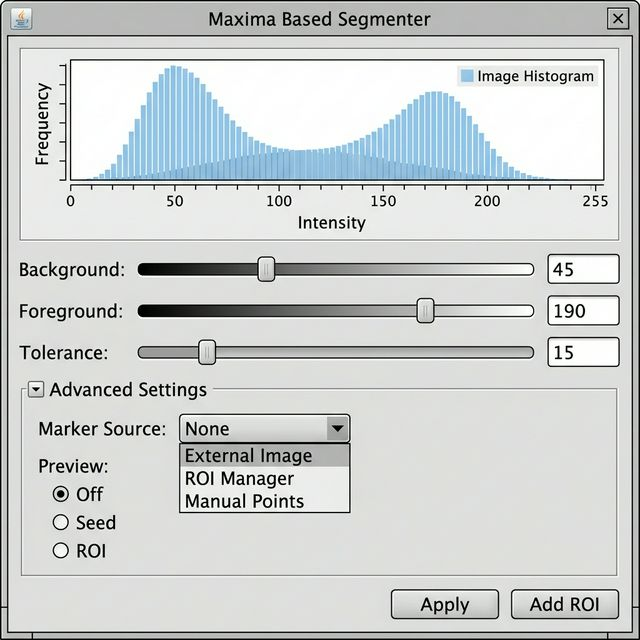
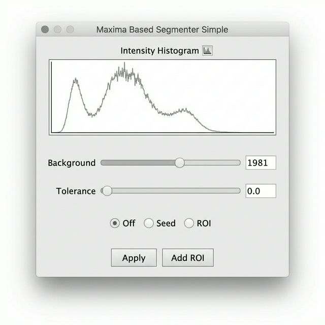
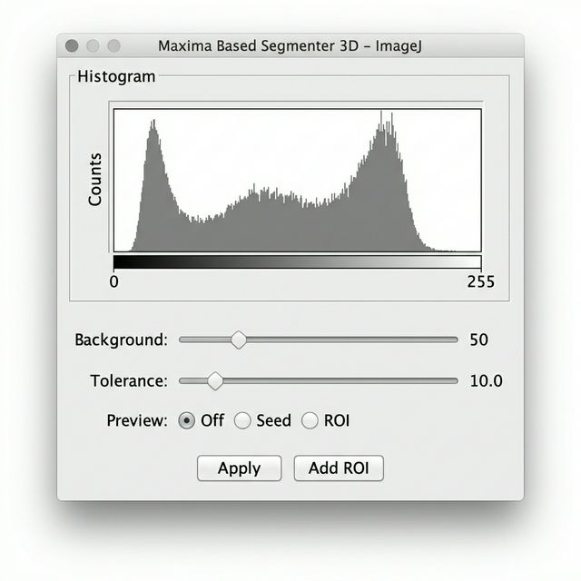

# Maxima-Based Segmenter Suite UI デザイン設計仕様

このドキュメントは、[design.md](./design.md) に基づき、Maxima-Based Segmenter Suiteに含まれる3つのプラグインのユーザーインターフェース（UI）の明確な設計仕様をまとめたものです。

## 1. Maxima_Based_Segmenter (アドバンスド/フル機能版プラグイン)

**目的**: 全ての高度なオプションを備えた、フル機能の2Dセグメンテーション・プラグインです。元の Area_Segmentater を改良し、より使いやすいデフォルト設定とUI挙動を提供します。

### UI モックアップ

### 主要コンポーネントと挙動
- **ヒストグラム表示**: 上部に画像強度の分布を表示し、閾値設定の視覚的なガイドとします。
- **Background (背景閾値) スライダー**: 処理対象となるドメイン領域（強度 >= BG_Threshold）を決定します。
- **Foreground (前景閾値) スライダー**:
  - `Marker Source` が `THRESHOLD_COMPONENTS` の場合のみ有効になり、`BG_Threshold <= FG_Threshold` の制約が強制されます。
- **Tolerance (許容誤差) スライダー**: FindMaxima アルゴリズムのシード検出におけるノイズ許容度を設定します。メインUIからアクセス可能です。
- **Advanced Settings (詳細設定パネル)**: 
  - 元の `Area_Segmentater` のフル機能を網羅する多数の高度な制御パラメータが含まれます。
  - **Marker Source**: `FIND_MAXIMA` (デフォルト), `THRESHOLD_COMPONENTS`, `ROI_MANAGER`, `BINARY_IMAGE` など。
  - **Method**: `WATERSHED`, `RANDOM_WALKER` などの領域分割アルゴリズム。
  - **Connectivity**: セグメンテーションに使用する近傍設定 (`C4` (4近傍), `C8` (8近傍))。
  - **Surface**: 解析対象のサーフェスタイプ (`INVERT_ORIGINAL`, `IMAGE`, `CONSTANT` など)。
  - **Gaussian Preprocessing**: 処理前の平滑化 (`Enable Preprocessing` チェックボックス)。有効時の `Sigma Surface` および `Sigma Seed` 値の指定。
  - **Overlap Rule**: セグメント重複時の統合・分割ルール。
  - **Seed Area Filters**: 検出シードの最小サイズ (`Seed Min Area`) および最大サイズ (`Seed Max Area`)。
  - **RandomWalker Beta**: RandomWalker アルゴリズム選択時のベータ値。
  - **その他のオプション**: `Invert Intensity` (強度反転), `Absorb Unknown` (境界の未知領域処理) などのチェックボックス。
- **Preview (プレビュー) ラジオボタン**: 
  - `Off`: プレビューなし / `Seed`: 検出シードポイントを描画 / `ROI`: セグメンテーション結果の境界線を描画
- **アクションボタン**:
  - `Apply`: 設定を確定し、ラベル画像を出力して終了 / `Add ROI`: 結果を ImageJ ROI Manager に追加

---

## 2. Maxima_Based_Segmenter_Simple (シンプル版プラグイン)

**目的**: 最小限のUIで迅速なウォーターシェッド・セグメンテーションを提供する、合理化された2D専用プラグインです。

### UI モックアップ

### 主要コンポーネントと挙動
- **固定パラメータ (UI非表示)**:
  - Connectivity: C4 (4近傍)
  - Method: WATERSHED
  - Surface: INVERT_ORIGINAL
  - Gaussian preprocessing: Disabled (無効)
  - MarkerSource: FIND_MAXIMA
- **ヒストグラム表示**: 強度分布を表示。
- **Background (背景閾値) スライダー**: ドメイン領域の決定に使用。前景（FG）側の設定は存在しません。
- **Tolerance (許容誤差) スライダー**: FindMaxima におけるシード検出の許容度を設定します。
- **Preview (プレビュー) ラジオボタン**: 
  - `Off` / `Seed` / `ROI` を切り替え。
- **アクションボタン**:
  - `Apply`: セグメンテーションを実行して結果の画像を出力
  - `Add ROI`: ImageJ ROI Manager に結果を追加

---

## 3. Maxima_Based_Segmenter_3D (3D版ボクセルプラグイン)

**目的**: `MorphoLibJ` プラグインのライブラリ関数を使用した3Dボクセルセグメンテーション用プラグインです。

### UI モックアップ

### 主要コンポーネントと挙動
レイアウトは「シンプル版」とほぼ同じ直線的な構成ですが、タイトルで3D処理であることを明示します。

- **入力の前提条件**:
  - 処理開始時に入力対象がXYZの3D画像スタック（Z > 1）であることを検証し、2D画像の場合はエラーを出してUIを開きません。
- **固定パラメータ**:
  - Connectivity: C6 (3Dの6近傍)
  - Method: MorphoLibJ 提供の Marker-Controlled Watershed 3D
  - Surface: INVERT_ORIGINAL
- **Background (背景閾値) スライダー**: 3Dドメインマスク（処理対象ボクセル領域）の閾値。
- **Tolerance (許容誤差) スライダー**: MorphoLibJ の Extended Maxima 3D 関数に渡す許容度パラメーター。
- **Preview (プレビュー)**: 
  - 全てのZ平面を一度に計算・描画するのではなく、**現在表示しているZ平面（スライス）のみ**をレンダリングします。Z平面を変更すると動的にプレビューが更新されます。
- **出力処理 (Add ROI)**:
  - 3Dオブジェクトを、ImageJ 互換の「Position (Z座標)」および「Group (オブジェクトID)」属性を持つ、2D ROIスライスの集合体として ROI Manager にエクスポートします (`RoiExporter3D`)。
