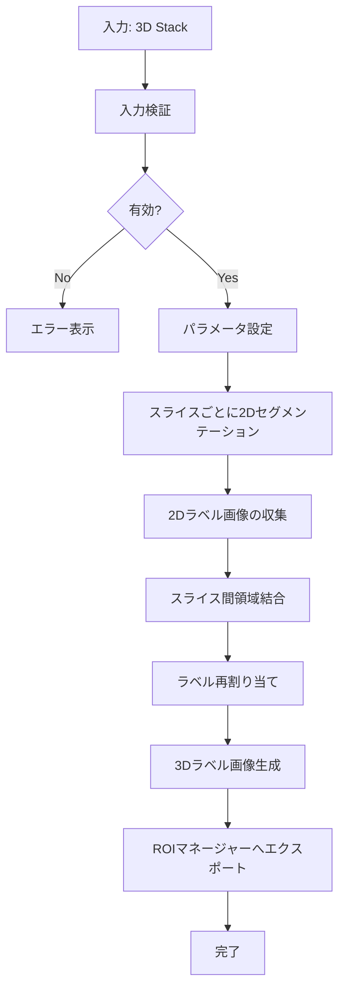

# Design Document: Slice-Based 3D Segmenter

## Overview

Slice-Based 3D Segmenterは、既存の2Dセグメンテーション手法（Maxima_Based_Segmenter_）を各スライスに適用し、スライス間で隣接する領域を3Dエリアとして結合する新しい3D画像処理機能です。

### 設計の動機

既存の3D版セグメンター（Maxima_Based_Segmenter_3D_）は、3D空間全体で直接Extended Maximaを検出し、3D Watershedを実行します。この手法は真の3D処理ですが、以下の課題があります：

- 3D処理は計算コストが高い
- スライスごとに異なる特性を持つ画像では最適でない場合がある
- 2Dで調整したパラメータを3Dに直接適用できない

Slice-Based 3D Segmenterは、以下の利点を提供します：

- 各スライスで2D処理を実行するため、計算効率が良い
- スライスごとに異なる特性に対応しやすい
- 2Dで確立したパラメータをそのまま使用できる
- 既存の2D版の全機能（Watershed、Random Walker、複数のマーカーソースなど）を活用できる

### アプローチの比較

**既存3D版（Maxima_Based_Segmenter_3D_）:**
- 3D Extended Maximaを直接検出
- 3D Watershedを実行
- C6接続性（6近傍）を使用
- パラメータ: bg_threshold、tolerance

**新しいSlice-Based版:**
- 各スライスで2D Extended Maximaを検出
- 各スライスで2D Watershed/Random Walkerを実行
- スライス間で領域を結合（C6接続性）
- パラメータ: 2D版の全パラメータ（bg_threshold、fg_threshold、tolerance、method、surface、connectivity、marker_source、preprocessing、sigmaなど）

## Architecture

### システム構成

```
Slice_Based_3D_Segmenter_ (PlugIn)
    ├── UI Layer
    │   └── SliceBased3DFrame (GUI)
    ├── Core Processing
    │   ├── SliceSegmenter (各スライスの2D処理)
    │   ├── SliceMerger (スライス間結合)
    │   └── LabelReassigner (ラベル再割り当て)
    ├── Configuration
    │   └── ThresholdModel (2D版と共有)
    └── Export
        └── RoiExporter3D (既存クラスを使用)
```

### 処理フロー



### レイヤー構造

1. **プラグインレイヤー**: ImageJ PlugInインターフェースの実装
2. **UIレイヤー**: GUIフレーム（マクロモードでは省略）
3. **コアレイヤー**: セグメンテーションロジック
4. **エクスポートレイヤー**: ROI出力

## Components and Interfaces

### 1. Slice_Based_3D_Segmenter_ (Main Plugin)

**責務**: ImageJ PlugInインターフェースの実装、エントリーポイント

**主要メソッド**:
```java
public class Slice_Based_3D_Segmenter_ implements PlugIn {
    @Override
    public void run(String arg);
    
    private void runMacroMode(String options);
    
    public static ImagePlus segment(
        ImagePlus imp,
        int bgThreshold,
        int fgThreshold,
        double tolerance,
        String method,
        String surface,
        String connectivity,
        String markerSource,
        boolean preprocessingEnabled,
        double sigmaSurface,
        double sigmaSeed
    );
}
```

**インターフェース**:
- 入力: ImagePlus（3D stack）、パラメータ
- 出力: ImagePlus（3D label image）

### 2. SliceSegmenter

**責務**: 各スライスで2Dセグメンテーションを実行

**主要メソッド**:
```java
public class SliceSegmenter {
    public List<ImagePlus> segmentAllSlices(
        ImagePlus stack3D,
        ThresholdModel model
    );
    
    private ImagePlus segmentSingleSlice(
        ImagePlus slice,
        ThresholdModel model,
        int sliceIndex
    );
}
```

**処理内容**:
1. 3Dスタックから各スライスを抽出
2. 各スライスに対してMarkerBuilderを実行
3. シードが見つかった場合、WatershedRunner/RandomWalkerRunnerを実行
4. シードが見つからない場合、空のラベル画像（全ピクセル0）を生成
5. 全スライスのラベル画像をリストとして返す

### 5. SliceMerger

**責務**: スライス間で隣接する領域を結合（改良版マッチングアルゴリズム）

**主要メソッド**:
```java
public class SliceMerger {
    public ImagePlus mergeSlices(List<ImagePlus> sliceLabels);
    
    private UnionFind buildConnectedComponents(List<ImagePlus> sliceLabels);
    
    private void performBidirectionalMatching(
        ImagePlus slice1, ImagePlus slice2, int z1, int z2, UnionFind uf);
    
    private Map<Integer, Map<Integer, Integer>> calculateAllOverlaps(
        ImagePlus slice1, ImagePlus slice2);
    
    private int findBestOverlapMatch(
        int sourceLabel, Set<Integer> candidates, 
        Map<Integer, Map<Integer, Integer>> overlapMatrix);
    
    private boolean hasOverlap(
        ImageProcessor slice1, ImageProcessor slice2,
        int label1, int label2);
        
    private int calculateOverlapArea(
        ImageProcessor slice1, ImageProcessor slice2,
        int label1, int label2);
}
```

**改良されたアルゴリズム**: 
- 双方向マッチング（対称性保証）
- 重なり面積による最適マッチング
- U字型構造の適切な処理
- 最小重なり閾値による誤結合防止

**処理内容**:
1. 各隣接スライスペアで双方向マッチングを実行
2. 重なり面積を計算して最適なペアを決定
3. Union-Findで連結成分をグループ化
4. 各グループに新しいラベルを割り当て

### 4. LabelReassigner

**責務**: ラベルを1から連続した整数に再割り当て

**主要メソッド**:
```java
public class LabelReassigner {
    public ImagePlus reassignLabels(ImagePlus labelImage);
    
    private Map<Integer, Integer> buildLabelMapping(ImagePlus labelImage);
}
```

**処理内容**:
1. 全ラベル値を収集（0を除く）
2. ソートして1から連続した整数にマッピング
3. 全ピクセルのラベルを新しい値に置き換え

### 5. SliceBased3DFrame (GUI)

**責務**: ユーザーインターフェース

**主要コンポーネント**:
- パラメータ入力フィールド（2D版と同じ）
- プレビュー機能
- 実行ボタン
- 進行状況表示

**既存コンポーネントの再利用**:
- DualThresholdFrameのUIコンポーネントを参考
- ThresholdModelを使用してパラメータ管理

### 6. UnionFind (データ構造)

**責務**: 連結成分の効率的な管理

**主要メソッド**:
```java
public class UnionFind {
    public UnionFind(int size);
    public int find(int x);
    public void union(int x, int y);
    public Map<Integer, List<Integer>> getGroups();
}
```

**実装**: 経路圧縮とランクによる結合を使用

## Data Models

### LabelKey

スライスとラベルの組み合わせを表すキー

```java
public class LabelKey {
    public final int sliceIndex;  // 0-based
    public final int label;       // 1-based
    
    public LabelKey(int sliceIndex, int label);
    
    @Override
    public boolean equals(Object o);
    
    @Override
    public int hashCode();
}
```

### SliceSegmentationResult

各スライスのセグメンテーション結果

```java
public class SliceSegmentationResult {
    public final int sliceIndex;
    public final ImagePlus labelImage;
    public final int regionCount;
    
    public SliceSegmentationResult(
        int sliceIndex,
        ImagePlus labelImage,
        int regionCount
    );
}
```

### MergeStatistics

結合処理の統計情報

```java
public class MergeStatistics {
    public final int totalSlices;
    public final int total2DRegions;
    public final int total3DRegions;
    public final long processingTimeMs;
    
    public MergeStatistics(
        int totalSlices,
        int total2DRegions,
        int total3DRegions,
        long processingTimeMs
    );
    
    public String toSummaryString();
}
```

### 既存データモデルの再利用

以下の既存クラスをそのまま使用：

- **ThresholdModel**: パラメータ管理
- **MarkerResult**: 2Dマーカー結果
- **SegmentationResult**: 2Dセグメンテーション結果
- **SegmentationResult3D**: 3Dセグメンテーション結果
- **Connectivity**: 接続性定義
- **Method**: セグメンテーション手法（Watershed/Random Walker）
- **Surface**: 表面定義
- **MarkerSource**: マーカーソース

## Slice Merging Algorithm

### アルゴリズムの詳細

スライス間の領域結合は、以下の手順で実行されます：

#### Phase 1: ラベルキーの収集

```
For each slice z in [0, nSlices-1]:
    For each unique label L in slice z (excluding 0):
        Create LabelKey(z, L)
        Assign unique ID to this LabelKey
```

#### Phase 2: 隣接関係の検出（改良版）

```
For each consecutive slice pair (z, z+1):
    // 双方向マッチング: z→z+1 と z+1→z の両方向を処理
    performBidirectionalMatching(slice[z], slice[z+1], z, z+1)
```

**performBidirectionalMatching関数**:
```
performBidirectionalMatching(slice1, slice2, z1, z2):
    // 全ての重なりを事前計算
    overlapMatrix = calculateAllOverlaps(slice1, slice2)
    
    // z1→z2方向のマッチング
    processMatching(slice1, slice2, z1, z2, overlapMatrix)
    
    // z2→z1方向のマッチング（対称性保証）
    processMatching(slice2, slice1, z2, z1, overlapMatrix.transpose())
```

**processMatching関数**:
```
processMatching(sourceSlice, targetSlice, sourceZ, targetZ, overlapMatrix):
    For each label L1 in sourceSlice:
        overlappingLabels = getOverlappingLabels(L1, overlapMatrix)
        
        If overlappingLabels.isEmpty():
            // ケース0: 終端 - 何もしない
            continue
            
        If overlappingLabels.size() == 1:
            // ケース1: 1対1マッチング（U字型構造対応）
            L2 = overlappingLabels.first()
            Union(LabelKey(sourceZ, L1), LabelKey(targetZ, L2))
            
        Else:
            // ケース2: 1対Nマッチング - 重なり面積による最適マッチング
            bestMatch = findBestOverlapMatch(L1, overlappingLabels, overlapMatrix)
            If bestMatch != null AND overlapRatio(L1, bestMatch) >= MIN_OVERLAP_RATIO:
                Union(LabelKey(sourceZ, L1), LabelKey(targetZ, bestMatch))
```

**calculateOverlapArea関数**:
```
calculateOverlapArea(slice1, slice2, label1, label2):
    overlapCount = 0
    For each pixel (x, y):
        If slice1[x,y] == label1 AND slice2[x,y] == label2:
            overlapCount++
    Return overlapCount
```

**findBestOverlapMatch関数**:
```
findBestOverlapMatch(sourceLabel, candidateLabels, overlapMatrix):
    bestLabel = null
    maxOverlap = 0
    
    For each candidateLabel in candidateLabels:
        overlap = overlapMatrix[sourceLabel][candidateLabel]
        If overlap > maxOverlap:
            maxOverlap = overlap
            bestLabel = candidateLabel
    
    Return bestLabel
```

**定数**:
```
MIN_OVERLAP_RATIO = 0.1  // 最小重なり閾値（10%）
```

この改良された実装は以下の特徴を持ちます：
- **双方向マッチング**: 上下スライスの順序に依存しない対称的な結果
- **重なり面積による最適マッチング**: 複数候補がある場合の競合解決
- **U字型構造対応**: 1つの領域が複数領域と重なる場合の適切な処理
- **最小重なり閾値**: ノイズによる誤結合の防止

#### Phase 3: 連結成分のグループ化

```
groups = UnionFind.getGroups()
For each group G:
    Assign new label newLabel (starting from 1)
    For each LabelKey(z, L) in G:
        mapping[(z, L)] = newLabel
```

#### Phase 4: ラベルの書き換え

```
For each slice z:
    For each pixel (x, y):
        oldLabel = slice[z][x,y]
        If oldLabel > 0:
            newLabel = mapping[(z, oldLabel)]
            slice[z][x,y] = newLabel
```

### 計算量

- **時間計算量**: O(N × M + R × S + L²)
  - N: 総ピクセル数（width × height × depth）
  - M: 隣接スライスペアの数（depth - 1）
  - R: 2D領域の総数
  - S: 重なり検出の平均コスト
  - L²: 重なり面積計算（最悪ケース：全領域ペア）
  
- **空間計算量**: O(R + L²)
  - R: 2D領域の総数（Union-Findのノード数）
  - L²: 重なり面積マトリックス

### 最適化戦略

1. **早期終了**: 重なり検出で最初の重なりを見つけたら即座に面積計算に移行
2. **重なり面積キャッシュ**: 計算済みの重なり面積を保存して再利用
3. **最小重なり閾値**: 閾値未満の重なりは無視して計算量を削減
4. **並列処理**: 各スライスの2Dセグメンテーションは独立しているため、並列実行可能
5. **バウンディングボックス**: 各領域のバウンディングボックスを事前計算し、重なり検出を高速化

## Comparison with Existing 3D Segmenter

### アルゴリズムの違い

| 特徴 | Maxima_Based_Segmenter_3D_ | Slice_Based_3D_Segmenter_ |
|------|---------------------------|---------------------------|
| Maxima検出 | 3D Extended Maxima | 2D Extended Maxima（各スライス） |
| Watershed | 3D Watershed | 2D Watershed/Random Walker（各スライス） |
| 接続性 | C6（3D全体） | C4/C8（スライス内）+ C6（スライス間） |
| パラメータ | bg_threshold、tolerance | 2D版の全パラメータ |
| 計算量 | O(N log N)（3D処理） | O(N/D × log(N/D) × D)（2D処理×D） |

### 使用シーンの違い

**Maxima_Based_Segmenter_3D_が適している場合**:
- 3D構造が等方的（X、Y、Z方向で同じ解像度）
- オブジェクトが3D空間で連続的に変化
- 真の3D形状認識が必要

**Slice_Based_3D_Segmenter_が適している場合**:
- Z方向の解像度が低い（スライス間隔が大きい）
- スライスごとに画像特性が異なる
- 2Dで確立したパラメータを使用したい
- Random Walkerなど2D版の高度な機能を使用したい
- 計算リソースが限られている

### パフォーマンス予測

**メモリ使用量**:
- 既存3D版: O(N)（3D画像 + 3Dラベル画像）
- Slice-Based版: O(N/D + R)（1スライス + Union-Find）

**処理時間**:
- 既存3D版: 3D処理のオーバーヘッドが大きい
- Slice-Based版: スライス数に比例、並列化可能

### 出力の互換性

両方のセグメンターは以下の点で互換性があります：

- **出力形式**: ImagePlus（3D label image）
- **ラベル範囲**: 1から連続した整数
- **ROIエクスポート**: 同じRoiExporter3Dクラスを使用
- **結果クラス**: SegmentationResult3D

これにより、既存のワークフローにシームレスに統合できます。


## Correctness Properties

*A property is a characteristic or behavior that should hold true across all valid executions of a system-essentially, a formal statement about what the system should do. Properties serve as the bridge between human-readable specifications and machine-verifiable correctness guarantees.*

### Property 1: Configuration Round-Trip

*For any* valid parameter configuration (bg_threshold, fg_threshold, tolerance, method, surface, connectivity, marker_source, preprocessing settings), when these parameters are set in the system and then retrieved, the retrieved values should match the original values exactly.

**Validates: Requirements 2.1, 2.2, 2.3, 2.4, 2.5, 2.6, 2.7, 2.8, 2.9, 2.10**

### Property 2: Overlapping Regions Merge

*For any* pair of adjacent slices (z, z+1) and any two labels L1 in slice z and L2 in slice z+1, if there exists at least one pixel coordinate (x, y) where slice[z][x,y] = L1 AND slice[z+1][x,y] = L2, then in the final 3D label image, all pixels labeled L1 in slice z and all pixels labeled L2 in slice z+1 should have the same final label value.

**Validates: Requirements 4.1**

### Property 3: 3D Label Image Generation and Format Compatibility

*For any* valid 3D stack input and valid parameter configuration, the segment API should return a 3D label image (ImagePlus) with the following properties:
- The image is not null
- The image has the same dimensions (width, height, depth) as the input
- The image is in the same format as the output from Maxima_Based_Segmenter_3D_
- All pixel values are non-negative integers

**Validates: Requirements 4.5, 8.2, 14.1**

### Property 4: Label Reassignment Correctness

*For any* 3D label image produced by the system, the following properties should hold:
- All background pixels have label value 0
- All foreground region labels form a consecutive sequence starting from 1 (i.e., if there are N regions, labels are {1, 2, 3, ..., N})
- Each 3D region has a unique label value (no two distinct regions share the same label)
- The total number of unique non-zero labels equals the number of 3D regions

**Validates: Requirements 5.1, 5.2, 5.3**

### Property 5: ROI Export Completeness

*For any* 3D label image with N regions, when exported to ROI Manager, the ROI Manager should contain ROIs that collectively cover all pixels with non-zero labels in the label image, and no ROI should cover pixels with label value 0.

**Validates: Requirements 6.1**

### Property 6: Macro Parameter Parsing Round-Trip

*For any* valid macro option string containing parameter key-value pairs, when the string is parsed by the system and the parameters are applied, the resulting configuration should match the parameters specified in the macro option string (or default values for unspecified parameters).

**Validates: Requirements 7.2**

### Property 7: Settings Persistence Round-Trip

*For any* valid parameter configuration, when the configuration is saved to ImageJ Preferences and then loaded back, the loaded configuration should match the original configuration exactly.

**Validates: Requirements 12.1**

### Property 8: Slice Processing Consistency

*For any* 3D stack and parameter configuration, if the same 2D segmentation is manually applied to each slice individually with the same parameters, and then the results are merged using the slice merging algorithm, the result should be equivalent to running the Slice_Based_3D_Segmenter on the entire stack.

**Validates: Requirements 3.1, 3.2**

### Property 9: Transitive Merging

*For any* three consecutive slices (z, z+1, z+2) with labels L1 in slice z, L2 in slice z+1, and L3 in slice z+2, if L1 overlaps with L2 AND L2 overlaps with L3, then L1, L2, and L3 should all receive the same final label value in the 3D label image (transitivity of the merge operation).

**Validates: Requirements 4.1, 4.4**

### Property 10: Empty Slice Handling

*For any* 3D stack where one or more slices produce no seeds (empty segmentation), the system should continue processing and produce a valid 3D label image where those slices have all pixels set to 0 (background), and regions in other slices are correctly identified and labeled.

**Validates: Requirements 3.3**


## Error Handling

### Input Validation Errors

**Error Type**: Invalid Input Image

**Conditions**:
- Input image is null
- Input image has fewer than 2 slices

**Handling Strategy**:
```java
if (imp == null) {
    IJ.error("Slice-Based 3D Segmenter", "No image provided.");
    return null;
}
if (imp.getNSlices() < 2) {
    IJ.error("Slice-Based 3D Segmenter", 
             "Image must be a 3D stack with at least 2 slices.");
    return null;
}
```

**User Impact**: Processing stops immediately with clear error message

### Processing Errors

**Error Type**: No Seeds Found in All Slices

**Conditions**:
- All slices produce zero seeds with current parameters

**Handling Strategy**:
```java
if (totalSeedCount == 0) {
    IJ.log("Slice-Based 3D Segmenter: No seeds found in any slice.");
    IJ.showMessage("Warning", 
                   "No regions detected. Try adjusting parameters.");
    return null;
}
```

**User Impact**: Warning message with suggestion to adjust parameters

**Error Type**: No Seeds Found in Some Slices

**Conditions**:
- Some slices produce zero seeds

**Handling Strategy**:
```java
if (markers.fgCount == 0) {
    IJ.log(String.format("Slice %d: No seeds found, treating as background.", 
                         sliceIndex + 1));
    // Create empty label image (all zeros)
    ImagePlus emptyLabel = createEmptyLabelImage(width, height);
    return emptyLabel;
}
```

**User Impact**: Processing continues, affected slices treated as background

### Runtime Errors

**Error Type**: Out of Memory

**Conditions**:
- Large 3D stacks exceed available memory

**Handling Strategy**:
```java
try {
    // Processing code
} catch (OutOfMemoryError e) {
    IJ.error("Slice-Based 3D Segmenter", 
             "Out of memory. Try processing a smaller region or increasing Java heap size.");
    IJ.log("Error: " + e.getMessage());
    return null;
}
```

**User Impact**: Clear error message with actionable advice

**Error Type**: Unexpected Exception

**Conditions**:
- Any unexpected runtime exception

**Handling Strategy**:
```java
try {
    // Processing code
} catch (Exception e) {
    IJ.error("Slice-Based 3D Segmenter", 
             "An error occurred during processing: " + e.getMessage());
    IJ.log("Stack trace:");
    e.printStackTrace();
    return null;
}
```

**User Impact**: Error logged with full stack trace for debugging

### Parameter Validation

**Error Type**: Invalid Parameter Values

**Conditions**:
- Negative threshold values
- Invalid tolerance values
- Unknown method/surface/connectivity strings

**Handling Strategy**:
```java
// Use defensive defaults
if (bgThreshold < 0) {
    IJ.log("Warning: bg_threshold < 0, using 0");
    bgThreshold = 0;
}
if (tolerance < 0) {
    IJ.log("Warning: tolerance < 0, using 0");
    tolerance = 0;
}
```

**User Impact**: Invalid values replaced with safe defaults, warning logged

### Logging Strategy

**Log Levels**:
- **INFO**: Normal processing progress
  - "Processing slice X/Y"
  - "Found N seeds in slice X"
  - "Merging complete: N 3D regions detected"
  
- **WARNING**: Recoverable issues
  - "No seeds found in slice X"
  - "Invalid parameter value, using default"
  
- **ERROR**: Fatal errors
  - "Invalid input image"
  - "Out of memory"
  - "Unexpected exception"

**Log Format**:
```
[Slice-Based 3D Segmenter] <LEVEL>: <Message>
```

## Testing Strategy

### Dual Testing Approach

This feature requires both unit tests and property-based tests for comprehensive coverage:

- **Unit tests**: Verify specific examples, edge cases, and error conditions
- **Property-based tests**: Verify universal properties across all inputs

Both testing approaches are complementary and necessary. Unit tests catch concrete bugs in specific scenarios, while property-based tests verify general correctness across a wide range of inputs.

### Property-Based Testing

**Framework**: Use **QuickCheck for Java** (or **jqwik**) for property-based testing

**Configuration**:
- Minimum 100 iterations per property test (due to randomization)
- Each property test must reference its design document property
- Tag format: `// Feature: slice-based-3d-segmenter, Property N: <property_text>`

**Property Test Implementation**:

Each correctness property from the design document should be implemented as a property-based test:

1. **Property 1: Configuration Round-Trip**
   - Generate random valid parameter configurations
   - Set parameters, retrieve them, verify equality
   - Tag: `// Feature: slice-based-3d-segmenter, Property 1: Configuration Round-Trip`

2. **Property 2: Overlapping Regions Merge**
   - Generate random 3D stacks with known overlapping regions
   - Run segmentation
   - Verify overlapping regions have same final label
   - Tag: `// Feature: slice-based-3d-segmenter, Property 2: Overlapping Regions Merge`

3. **Property 3: 3D Label Image Generation and Format Compatibility**
   - Generate random valid 3D stacks
   - Run segmentation
   - Verify output format and dimensions
   - Tag: `// Feature: slice-based-3d-segmenter, Property 3: 3D Label Image Generation and Format Compatibility`

4. **Property 4: Label Reassignment Correctness**
   - Generate random 3D label images
   - Verify label properties (consecutive, unique, background=0)
   - Tag: `// Feature: slice-based-3d-segmenter, Property 4: Label Reassignment Correctness`

5. **Property 5: ROI Export Completeness**
   - Generate random 3D label images
   - Export to ROI Manager
   - Verify all non-zero pixels covered by ROIs
   - Tag: `// Feature: slice-based-3d-segmenter, Property 5: ROI Export Completeness`

6. **Property 6: Macro Parameter Parsing Round-Trip**
   - Generate random macro option strings
   - Parse and verify parameters
   - Tag: `// Feature: slice-based-3d-segmenter, Property 6: Macro Parameter Parsing Round-Trip`

7. **Property 7: Settings Persistence Round-Trip**
   - Generate random configurations
   - Save, load, verify equality
   - Tag: `// Feature: slice-based-3d-segmenter, Property 7: Settings Persistence Round-Trip`

8. **Property 8: Slice Processing Consistency**
   - Generate random 3D stacks
   - Compare batch processing vs manual slice-by-slice
   - Tag: `// Feature: slice-based-3d-segmenter, Property 8: Slice Processing Consistency`

9. **Property 9: Transitive Merging**
   - Generate 3D stacks with transitive overlaps
   - Verify transitivity of merge operation
   - Tag: `// Feature: slice-based-3d-segmenter, Property 9: Transitive Merging`

10. **Property 10: Empty Slice Handling**
    - Generate 3D stacks with some empty slices
    - Verify empty slices are all background (0)
    - Tag: `// Feature: slice-based-3d-segmenter, Property 10: Empty Slice Handling`

### Unit Testing

**Framework**: JUnit 5

**Test Categories**:

1. **Input Validation Tests**
   - Test null input (Example from Requirements 1.1)
   - Test insufficient slices (Example from Requirements 1.2)
   - Test valid 3D stack acceptance

2. **Edge Case Tests**
   - Single region spanning all slices
   - No overlapping regions (each slice independent)
   - All slices empty (no seeds)
   - Single slice with seeds, others empty

3. **Algorithm Tests**
   - Union-Find correctness
   - Overlap detection accuracy
   - Label reassignment correctness

4. **Integration Tests**
   - End-to-end processing with known input
   - Comparison with manual results
   - ROI export verification

5. **Macro Mode Tests**
   - Macro option parsing (Example from Requirements 7.1)
   - Default value usage (Example from Requirements 7.3)
   - API null return on failure (Example from Requirements 8.4)

6. **Error Handling Tests**
   - No seeds found logging (Example from Requirements 10.1)
   - Exception logging (Example from Requirements 10.3)

7. **Performance Tests**
   - Time measurement logging (Example from Requirements 11.1-11.4)
   - Memory usage tracking

8. **Statistics Tests**
   - Region count reporting (Example from Requirements 13.1-13.3)

**Test Data**:
- Synthetic 3D stacks with known properties
- Small real-world sample images
- Edge case images (empty, single region, many regions)

### Test Coverage Goals

- **Line Coverage**: > 80%
- **Branch Coverage**: > 75%
- **Property Tests**: All 10 properties implemented
- **Unit Tests**: All edge cases and examples covered

### Continuous Integration

- Run all tests on every commit
- Property tests with 100 iterations in CI
- Performance regression detection
- Memory leak detection

### Manual Testing Checklist

- [ ] GUI displays all parameters correctly
- [ ] Preview updates in real-time
- [ ] ROI Manager shows correct regions
- [ ] Processing time is reasonable for typical images
- [ ] Error messages are clear and actionable
- [ ] Settings persist across sessions
- [ ] Macro recording works correctly
- [ ] Results match visual inspection

